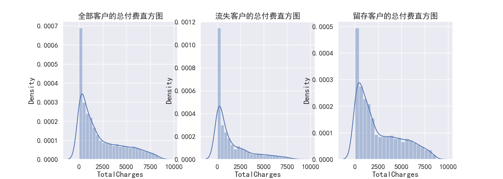
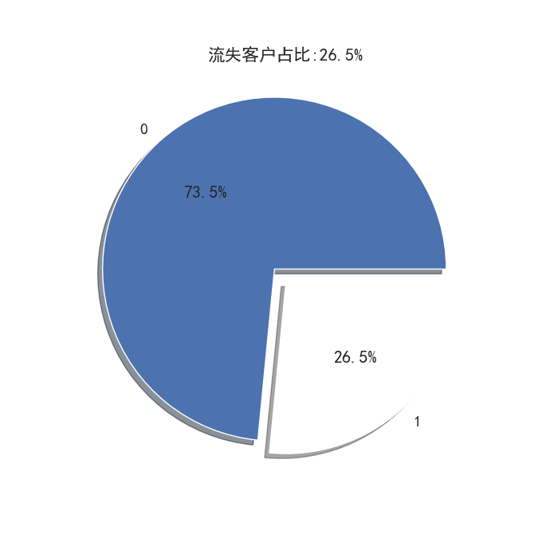
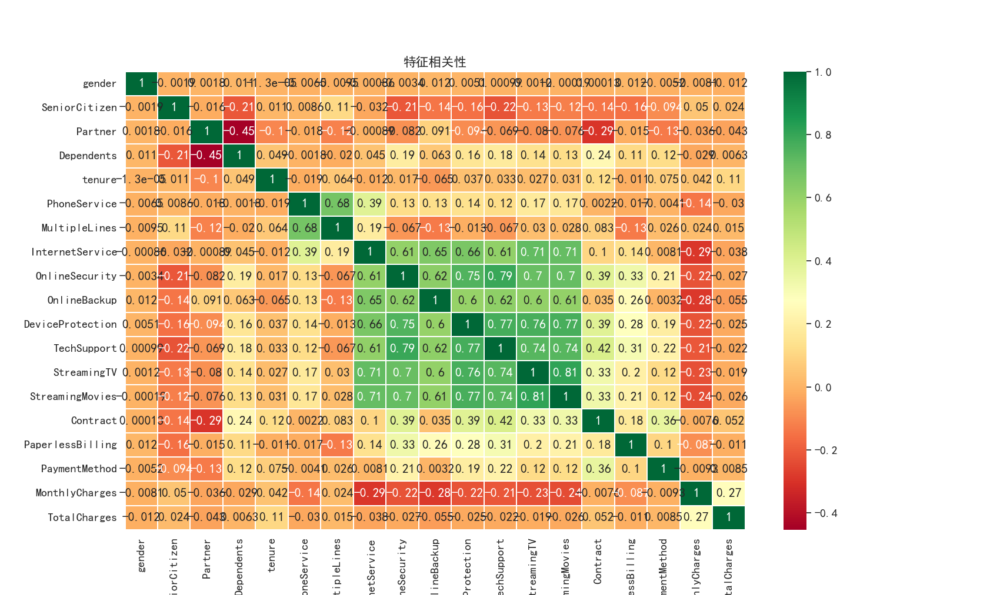
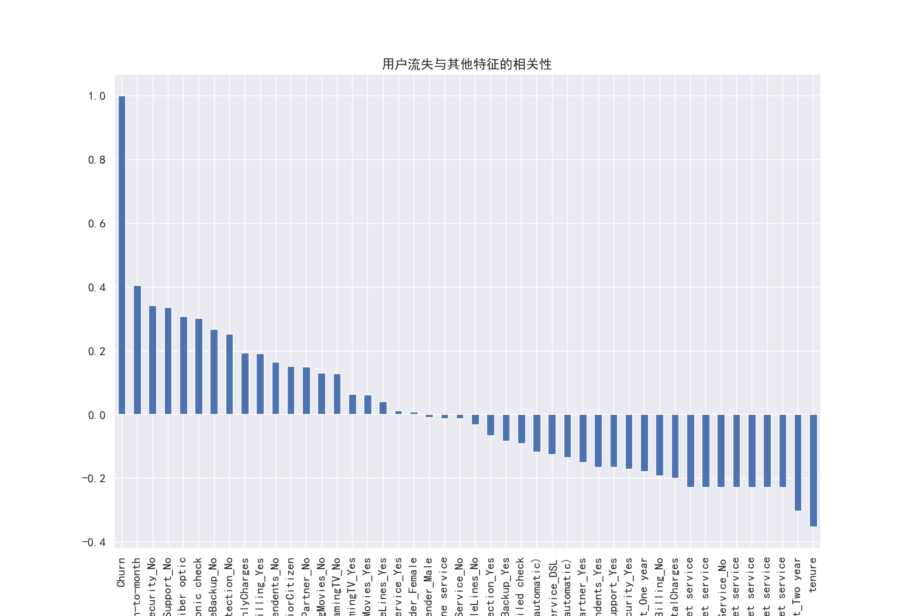
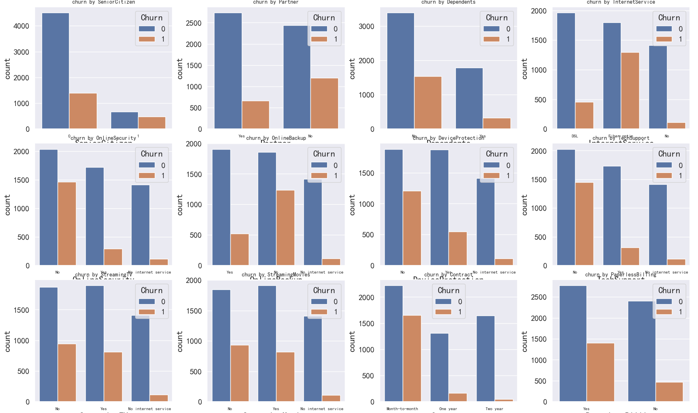
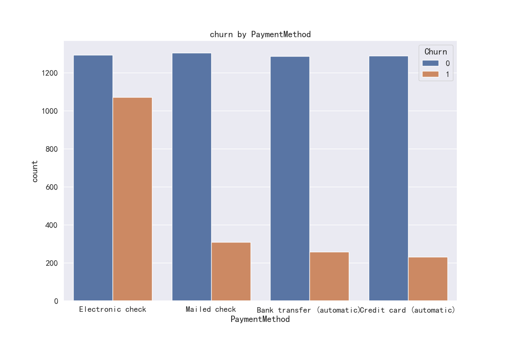
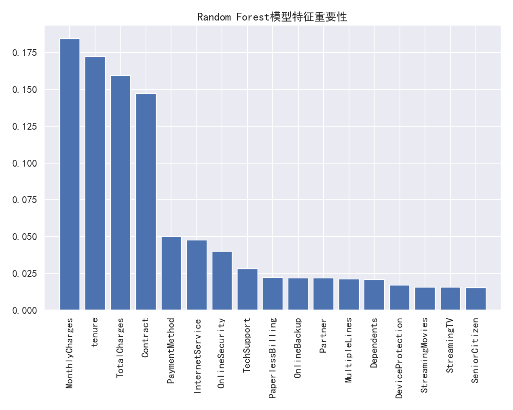
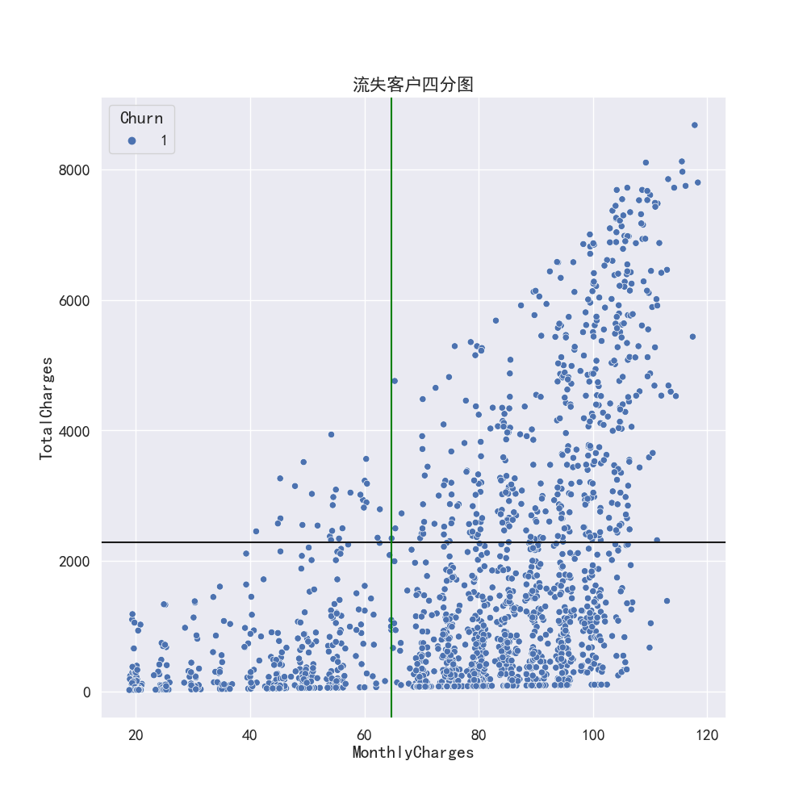
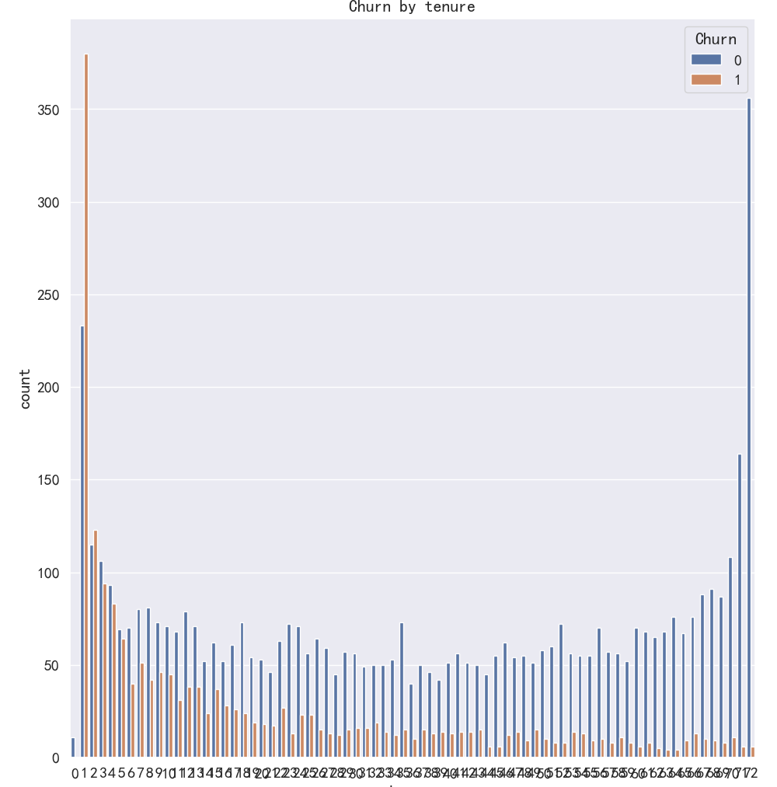

# 电信客户流失分析（Telco Customer Churn数据集）

## 电信客户流失分析项目简介
本项目的核心流程包括数据读取、数据清洗、特征选择、统计分析、特征工程、模型训练与评估、以及特征重要性分析。通过综合应用统计分析方法，深入分析分类变量和连续变量特征的关系，确保数据的高质量和模型的高效性。接下来，我们利用九种主流机器学习算法（包括 Random Forest、SVC、Logistic Regression、Naive Bayes、Decision Tree、AdaBoost、GBDT、XGB、CatBoost）进行建模，并通过模型输出的特征重要性进行分析，识别对客户流失预测最具影响力的因素。基于特征重要性分析结果，制定针对性的客户留存提升策略，优化客户管理与服务，减少流失并提升业务增长。

Telco Customer Churn数据集下载和详细介绍地址：[https://www.kaggle.com/datasets/blastchar/telco-customer-churn](https://www.kaggle.com/datasets/blastchar/telco-customer-churn)

## 数据清洗
### 查看缺失值：无缺失值
```
print('缺失值\n',df.isnull().sum())
```

```
缺失值
 customerID          0
gender              0
SeniorCitizen       0
Partner             0
Dependents          0
tenure              0
PhoneService        0
MultipleLines       0
InternetService     0
OnlineSecurity      0
OnlineBackup        0
DeviceProtection    0
TechSupport         0
StreamingTV         0
StreamingMovies     0
Contract            0
PaperlessBilling    0
PaymentMethod       0
MonthlyCharges      0
TotalCharges        0
Churn               0
```

### 查看重复值：无重复值
```
print('重复值\n',df.duplicated().sum())
```

```
重复值
 0
```


### 查看数据类型：“TotalCharges”数据类型是object，应该改为float64数据类型，保持与”MonthlyCharges“一致；

```
print('数据类型',df.info())
```

```
数据类型
Data columns (total 21 columns):
 #   Column            Non-Null Count  Dtype  
---  ------            --------------  -----  
 0   customerID        7043 non-null   object 
 1   gender            7043 non-null   object 
 2   SeniorCitizen     7043 non-null   int64  
 3   Partner           7043 non-null   object 
 4   Dependents        7043 non-null   object 
 5   tenure            7043 non-null   int64  
 6   PhoneService      7043 non-null   object 
 7   MultipleLines     7043 non-null   object 
 8   InternetService   7043 non-null   object 
 9   OnlineSecurity    7043 non-null   object 
 10  OnlineBackup      7043 non-null   object 
 11  DeviceProtection  7043 non-null   object 
 12  TechSupport       7043 non-null   object 
 13  StreamingTV       7043 non-null   object 
 14  StreamingMovies   7043 non-null   object 
 15  Contract          7043 non-null   object 
 16  PaperlessBilling  7043 non-null   object 
 17  PaymentMethod     7043 non-null   object 
 18  MonthlyCharges    7043 non-null   float64
 19  TotalCharges      7043 non-null   object 
 20  Churn             7043 non-null   object 
```
- 修改数据类型，并再次查看缺失值:发现TotalCharges有11个缺失值
```
df['TotalCharges'] = pd.to_numeric(df['TotalCharges'],errors='coerce')
print(df['TotalCharges'].dtype)#查看转换后的数据类型是不是float64
#（4）转换数据后再次查看缺失值
print('缺失值第二次查询\n',df.isnull().sum())
```
```
缺失值第二次查询
 customerID           0
gender               0
SeniorCitizen        0
Partner              0
Dependents           0
tenure               0
PhoneService         0
MultipleLines        0
InternetService      0
OnlineSecurity       0
OnlineBackup         0
DeviceProtection     0
TechSupport          0
StreamingTV          0
StreamingMovies      0
Contract             0
PaperlessBilling     0
PaymentMethod        0
MonthlyCharges       0
TotalCharges        11
Churn                0
```
- 缺失值填充：
  * 缺失值填充的原则：
    分类型数据：众数填充(因为不是数值型，用出现次数最多类别填充，保持数据原有分布的特性）

    数值型数据：正态分布，均值填充（保持数据的对称性）；偏态分布，中位数填充（中位数比均值更能代表数据的中心趋势，减少极端值对整体数据的影响）
  * 做直方图查看数据分布状态，再决定填充方式：全部客户、流失客户、留存客户分别做图
```
plt.figure(figsize=(14,5))
plt.subplot(1,3,1)
plt.title('全部客户的总付费直方图')
sns.distplot(df['TotalCharges'].dropna())

plt.subplot(1,3,2)
plt.title('流失客户的总付费直方图')
sns.distplot(df[df['Churn']=='Yes']['TotalCharges'].dropna())

plt.subplot(1,3,3)
plt.title('留存客户的总付费直方图')
sns.distplot(df[df['Churn']=='No']['TotalCharges'].dropna())
plt.show()
```

  * 三个直方图均显示未偏态分布，选择中位数填充
```
df.fillna({'TotalCharges':df['TotalCharges'].median()},inplace=True)
print('填充中位数后检查空值\n',df.isnull().sum())
```

### 查看样本分布：绘制饼图查看流失客户占比：发现流失客户占比 26.5%，存在样本不均衡的情况
- 处理思路：分层抽样、过抽样、欠抽样分别进行测试，最后选择得分最高的方法为过抽样，具体实验请看代码文件（项目代码文件已上传）
```
#(1)将'churn'列重新编码为0 1
df['Churn']=df['Churn'].map({'Yes':1,'No':0})
print('预览重新编码后的Churn',df['Churn'].head())#检查
#(2)绘制饼图查看流失客户占比
churn_value = df['Churn'].value_counts()
labels = df['Churn'].value_counts().index
churn_per = churn_value[1]/churn_value.sum()*100
plt.figure(figsize=(7,7))
plt.pie(churn_value,labels=labels,colors=['b','w'],explode=(0.1,0),autopct='%1.1f%%',shadow=True)
plt.title('流失客户占比:{:.1f}%'.format(churn_per))
plt.show()
```


## 特征选择
### 整数编码：查看变量间两两相关性并可视化
观察热力图可知：InternetService、OnlineSecurity、OnlineBackup、DeviceProtection、TechSupport、StreamingTV
StreamingMovies之间相关性很强，PhoneService、MultipleLines业务也存在很强正相关关系
```
#1、整数编码
features = df.iloc[:,1:20]#提取特征
#（1）查看变量间两两相关性
corr_df = features.apply(lambda x: pd.factorize(x)[0])
print('特征整数编码\n',corr_df.head())
corr = corr_df.corr()
print('特征相关性矩阵\n',corr)
#（2）可视化相关性矩阵：画热力图
plt.figure(figsize=(17,14))
ax = sns.heatmap(corr,xticklabels=corr.columns,yticklabels=corr.columns,
                 linewidths=0.2,cmap='RdYlGn',annot=True)
plt.title('特征相关性')
plt.show()
```


### 独热编码onehot：查看研究对象“churn”用户流失与其他特征的相关性
- 观察图可知：
  * 相关性大于15%：Contract、OnlineSecurity、TechSupport、InternetService、PaymentMethod、OnlineBackup、DeviceProtection
SeniorCitizen、Partner、Dependents、MonthlyCharges、tenure、StreamingTV、StreamingMovies、PaperlessBilling、TotalCharges
  * 相关性几乎为0：gender、PhoneService
- 后面进一步分析仅考虑相关性大于15%的特征
```
df_onehot = pd.get_dummies(df.iloc[:,1:21])
#(1)可视化：查看用户流失churn与各个特征关系
plt.figure(figsize=(15,12))
df_onehot.corr()['Churn'].sort_values(ascending=False).plot(kind='bar')
plt.title('用户流失与其他特征的相关性')
print(df_onehot.corr()['Churn'].sort_values(ascending=False))
plt.show()

kf_var = list(df.columns[2:6])
for var in list(df.columns[8:20]):
    kf_var.append(var)
print('kf_var=',kf_var)
```


## 统计分析

### 分类型数据：频数分布比较
- 卡方检验：判断组间是否有显著性差异，决定是否继续进行频数分布比较：分类型特征均通过卡方检验，TotalCharges组间无显著性差异，因为TotalCharges是连续变量，放到连续变量板块专门分析

```
def KF(x):
    df1 = pd.crosstab(df['Churn'],df[x])
    li1 = list(df1.iloc[0,:])
    li2 = list(df1.iloc[1,:])
    kf_data = np.array([li1,li2])
    #将两个列表 li1 和 li2 作为两个单独的数组元素，创建了一个新的二维 NumPy 数组进行检验两个变量是否独立
    kf = chi2_contingency(kf_data)
    if kf[1] < 0.05:
        print('churn by {} 的卡方临界值是{:.2f},小于0.05，说明{}组间有显著性差异，可进行【交叉分析】'.format(x,kf[1],x),'\n')
    else:
        print('churn by {} 的卡方临界值是{:.2f},大于0.05，表面{}组间无显著性差异，不可进行交叉分析'.format(x,kf[1],x),'\n')
print('kf_var高相关系特征与用户流失的卡方检验结果如下：','\n')
print(list(map(KF,kf_var)))

kf_var高相关系特征与用户流失的卡方检验结果如下： 

churn by SeniorCitizen 的卡方临界值是0.00,小于0.05，说明SeniorCitizen组间有显著性差异，可进行【交叉分析】 

churn by Partner 的卡方临界值是0.00,小于0.05，说明Partner组间有显著性差异，可进行【交叉分析】 

churn by Dependents 的卡方临界值是0.00,小于0.05，说明Dependents组间有显著性差异，可进行【交叉分析】 

churn by tenure 的卡方临界值是0.00,小于0.05，说明tenure组间有显著性差异，可进行【交叉分析】 

churn by InternetService 的卡方临界值是0.00,小于0.05，说明InternetService组间有显著性差异，可进行【交叉分析】 

churn by OnlineSecurity 的卡方临界值是0.00,小于0.05，说明OnlineSecurity组间有显著性差异，可进行【交叉分析】 

churn by OnlineBackup 的卡方临界值是0.00,小于0.05，说明OnlineBackup组间有显著性差异，可进行【交叉分析】 

churn by DeviceProtection 的卡方临界值是0.00,小于0.05，说明DeviceProtection组间有显著性差异，可进行【交叉分析】 

churn by TechSupport 的卡方临界值是0.00,小于0.05，说明TechSupport组间有显著性差异，可进行【交叉分析】 

churn by StreamingTV 的卡方临界值是0.00,小于0.05，说明StreamingTV组间有显著性差异，可进行【交叉分析】 

churn by StreamingMovies 的卡方临界值是0.00,小于0.05，说明StreamingMovies组间有显著性差异，可进行【交叉分析】 

churn by Contract 的卡方临界值是0.00,小于0.05，说明Contract组间有显著性差异，可进行【交叉分析】 

churn by PaperlessBilling 的卡方临界值是0.00,小于0.05，说明PaperlessBilling组间有显著性差异，可进行【交叉分析】 

churn by PaymentMethod 的卡方临界值是0.00,小于0.05，说明PaymentMethod组间有显著性差异，可进行【交叉分析】 

churn by MonthlyCharges 的卡方临界值是0.00,小于0.05，说明MonthlyCharges组间有显著性差异，可进行【交叉分析】 

churn by TotalCharges 的卡方临界值是0.55,大于0.05，表面TotalCharges组间无显著性差异，不可进行交叉分析 
```

- 频数分布比较：柱状图
  * 通过柱状图初步看出具体特征类别对客户流失的影响，但是还不能就此判断，因为样本数据不均衡（流失客户样本占比26.5%），所以不能直接通过频数的柱状图去分析，而应该用百分比可以更清楚了解流失客户在总样本的比例（用交叉表分析不同特征变量与客户流失的关系）
  * 解决办法：交叉分析且做同行百分比

```
plt.figure(figsize=(20,25))
a = 0
for k in [var for var in kf_var if var != 'tenure' and var != 'MonthlyCharges' and var != 'PaymentMethod'
          and var != 'TotalCharges']:
    #因为TotalCharges、tenure、MonthlyCharges为连续变量（数值），用柱状图无法好的分类，PaymentMethod单独画效果好
    a = a+1
    plt.subplot(3,4,a)
    plt.title('churn by ' + k,fontsize=10)
    sns.countplot(x=k,hue='Churn',data=df)
    plt.tick_params(axis='x',labelsize=8)
plt.subplots_adjust(wspace=0.3,hspace=0.5)
plt.tight_layout()
plt.show()

plt.figure(figsize=(12,8))
plt.title('churn by PaymentMethod')
sns.countplot(x='PaymentMethod',hue='Churn',data=df)
plt.show()
```



- 交叉分析:交叉分析是针对分类变量进行的，因为它的目的是查看不同类别之间的分布差异。对于连续变量，通常需要进行分箱操作，MonthlyCharges 和 tenure不分箱就不要做交叉分析，因为会得到很多组，使得难以解释
```
print('ka_var列表中的特征向量与Churn用户流失交叉分析结果如下：','\n')
for i in [var for var in kf_var if var != 'MonthlyCharges' and var != 'tenure'
          and var != 'TotalCharges']:
    print('...............churn by {}...............'.format(i))
    print(pd.crosstab(df['Churn'],df[i],normalize=0),'\n')#交叉分析,同行百分比
```

```
ka_var列表中的特征向量与Churn用户流失交叉分析结果如下： 

...............churn by SeniorCitizen...............
SeniorCitizen         0         1
Churn                            
0              0.871279  0.128721
1              0.745318  0.254682 

...............churn by Partner...............
Partner        No       Yes
Churn                      
0        0.471782  0.528218
1        0.642055  0.357945 

...............churn by Dependents...............
Dependents        No       Yes
Churn                         
0           0.655199  0.344801
1           0.825575  0.174425 

...............churn by InternetService...............
InternetService       DSL  Fiber optic        No
Churn                                           
0                0.379204     0.347700  0.273096
1                0.245586     0.693954  0.060460 

...............churn by OnlineSecurity...............
OnlineSecurity        No  No internet service       Yes
Churn                                                  
0               0.393699             0.273096  0.333204
1               0.781701             0.060460  0.157838 

...............churn by OnlineBackup...............
OnlineBackup        No  No internet service       Yes
Churn                                                
0             0.358523             0.273096  0.368380
1             0.659711             0.060460  0.279829 

...............churn by DeviceProtection...............
DeviceProtection        No  No internet service       Yes
Churn                                                    
0                 0.364128             0.273096  0.362775
1                 0.647940             0.060460  0.291600 

...............churn by TechSupport...............
TechSupport        No  No internet service       Yes
Churn                                               
0            0.391767             0.273096  0.335137
1            0.773676             0.060460  0.165864 

...............churn by StreamingTV...............
StreamingTV        No  No internet service       Yes
Churn                                               
0            0.361036             0.273096  0.365868
1            0.504013             0.060460  0.435527 

...............churn by StreamingMovies...............
StreamingMovies        No  No internet service       Yes
Churn                                                   
0                0.356977             0.273096  0.369927
1                0.501873             0.060460  0.437667 

...............churn by Contract...............
Contract  Month-to-month  One year  Two year
Churn                                       
0               0.429068  0.252609  0.318322
1               0.885500  0.088818  0.025682 

...............churn by PaperlessBilling...............
PaperlessBilling        No       Yes
Churn                               
0                 0.464438  0.535562
1                 0.250936  0.749064 

...............churn by PaymentMethod...............
PaymentMethod  Bank transfer (automatic)  Credit card (automatic)  Electronic check  Mailed check
Churn                                                                                            
0                               0.248550                 0.249324          0.250097      0.252029
1                               0.138042                 0.124131          0.573034      0.164794 
```

### 数值型数据：均值比较，先通过齐性分析，再通过方差分析，最后才能做均值比较
- 齐性分析-方差分析（ANOVA）：齐性分析用来确定参与方差分析的多组数据是否来自具有相同方差的总体，方差分析主要用于连续变量，用于比较两个或多个样本组的均值是否存在显著差异。
- 结果：三个变量均不通过齐性检验，不可进行方差分析

```
def ANOVA(x):
    li_index = list(df['Churn'].value_counts().keys())
    args = []
    for i in li_index:
        args.append(df[df['Churn']==i][x])
    w,p = levene(*args)
    if p < 0.05:
        print('警告：churn by {}的p值是{:.2f},小于0.05，表明齐性检验不通过，不可做方差分析'.format(x,p),'\n')
    else:
        f,p_value = f_oneway(*args)
        print('churn by {} 的f值是{},p值是{}'.format(x,f,p_value),'\n')
        if p_value < 0.05:
            print('churn by {}的均值有显著性差异，可进行均值比较'.format(x),'\n')
        else:
            print('churn by {}的均值无显著差异，不可进行均值比较'.format(x),'\n')
print('TotalCharges、MonthlyCharges、tenure的齐性检验和方差分析结果如下：','\n')
ANOVA('TotalCharges')
ANOVA('MonthlyCharges')
ANOVA('tenure')
```

```
TotalCharges、MonthlyCharges、tenure的齐性检验和方差分析结果如下： 

警告：churn by TotalCharges的p值是0.00,小于0.05，表明齐性检验不通过，不可做方差分析 

警告：churn by MonthlyCharges的p值是0.00,小于0.05，表明齐性检验不通过，不可做方差分析 

警告：churn by tenure的p值是0.00,小于0.05，表明齐性检验不通过，不可做方差分析 
```

### 统计分析综合结果
1、SeniorCitizen：年轻客户在流失和留存占比都高

2、Partner：单身客户易流失

3、Dependents：经济不独立易流失

4、InternetService：办理Fiber optic光纤易流失

5、OnlineSecurity：没开通网络安全易流失

6、OnlineBackup：没开通网络备份易流失

7、DeviceProtection：没开通设备保护服务易流失

8、TechSupport：没开通技术支持易流失

9、StreamingTV、StreamingMovies：开通网络电视和电影对用户留存和流失影响不明显

10、Contract：逐月签合同易流失

11、PaperlessBilling：用电子账单易流失

12、PaymentMethod：用电子支票支付更容易流失

如果是实际业务，我们可以在SQL上找有以上特征的客户，进行精准营销，即可以降低用户流失。虽然特征选得越多，越精确，但覆盖的人群也会越少。故我们还需要计算“特征”的【重要性】，将最为重要的几个特征作为筛选条件。

## 特征工程
挑选常见 9 个机器学习算法模型，进行批量训练，然后挑出得分最高的模型，进一步计算“特征重要性”。

### 提取特征
由上一轮分析将gender、PhoneService剔除，customerID是随机数不影响建模也剔除
```
churn_var = df.iloc[:,2:20]
churn_var.drop('PhoneService',axis=1,inplace=True)
print(churn_var.head())
print(churn_var.dtypes)
```

### 判断量纲差异大小
- 根据结果可知：SeniorCitizen是个二分类问题，只有tenure、MonthlyCharges、TotalCharges存在量纲差异大问题
- 解决思路：标准化、离散化，哪个模型精度高选哪个
```
numeric_cols = churn_var.select_dtypes(include=[np.int64,np.float64])
max_v = numeric_cols.max()
min_v = numeric_cols.min()
print('特征列的最大值')
print(max_v)
print('特征列的最小值')
print(min_v)
value_ranges = max_v-min_v
print('特征列的取值范围')
print(value_ranges)
```

```
特征列的最大值
SeniorCitizen        1.00
tenure              72.00
MonthlyCharges     118.75
TotalCharges      8684.80
dtype: float64
特征列的最小值
SeniorCitizen      0.00
tenure             0.00
MonthlyCharges    18.25
TotalCharges      18.80
dtype: float64
特征列的取值范围
SeniorCitizen        1.0
tenure              72.0
MonthlyCharges     100.5
TotalCharges      8666.0
```

#### 标准化处理量纲差异大
经过实验标准化处理量纲差异大最终评分更高，离散化处理量纲差异大的代码，请见完整版代码文件（已上传github）
```
scaler = StandardScaler(copy=False)
scaler.fit_transform(churn_var[['tenure','MonthlyCharges','TotalCharges']])
#fit_transform先进行每个特征均值和标准差计算，然后对每个数据进行标准化处理x-u/o
churn_var[['tenure','MonthlyCharges','TotalCharges']] = scaler.transform(churn_var[['tenure',
                                                                                    'MonthlyCharges',
                                                                                    'TotalCharges']])
#将转换的标准化数据赋值给原列表
print(churn_var[['tenure','MonthlyCharges','TotalCharges']].head())
```

### 分类数据转换为整数编码
- 查看分类变量的标签：SeniorCitizen实际只有0 1也是分类变量也加进去
- 通过前面交叉分析发现，特征OnlineSecurity、OnlineBackup、DeviceProtection、TechSupport、StreamingTV、StreamingMovies
下面的标签No internet service都是一样的，这6个特征都跟网上增值服务有关，可以判断No internet service不影响客户流失
逻辑是这6项增值服务必须要开通互联网服务才能享受，没开通互联网服务就视为没开通这6项增值服务，所以将这6个特征中的No internet service标签
合并到no里面
```
def label(x):
    print(x,'--',churn_var[x].unique())
df_object = churn_var.select_dtypes(include='object')
df_object['SeniorCitizen'] = churn_var['SeniorCitizen']
print(df_object.dtypes)
print(list(map(label,df_object)))

churn_var.replace(to_replace='No internet service',value='No',inplace=True)
print('调整分类特征标签后\n',list(map(label,df_object)))

#(2)整数编码
def Label_encode(x):
    churn_var[x] = LabelEncoder().fit_transform(churn_var[x])
for i in range(0,len(df_object.columns)):
    Label_encode(df_object.columns[i])
print(list(map(label,df_object.columns)))
```

```
Partner -- ['Yes' 'No']
Dependents -- ['No' 'Yes']
MultipleLines -- ['No phone service' 'No' 'Yes']
InternetService -- ['DSL' 'Fiber optic' 'No']
OnlineSecurity -- ['No' 'Yes' 'No internet service']
OnlineBackup -- ['Yes' 'No' 'No internet service']
DeviceProtection -- ['No' 'Yes' 'No internet service']
TechSupport -- ['No' 'Yes' 'No internet service']
StreamingTV -- ['No' 'Yes' 'No internet service']
StreamingMovies -- ['No' 'Yes' 'No internet service']
Contract -- ['Month-to-month' 'One year' 'Two year']
PaperlessBilling -- ['Yes' 'No']
PaymentMethod -- ['Electronic check' 'Mailed check' 'Bank transfer (automatic)'
 'Credit card (automatic)']
SeniorCitizen -- [0 1]
```

```
Partner -- [1 0]
Dependents -- [0 1]
MultipleLines -- [1 0 2]
InternetService -- [0 1 2]
OnlineSecurity -- [0 1]
OnlineBackup -- [1 0]
DeviceProtection -- [0 1]
TechSupport -- [0 1]
StreamingTV -- [0 1]
StreamingMovies -- [0 1]
Contract -- [0 1 2]
PaperlessBilling -- [1 0]
PaymentMethod -- [2 3 0 1]
SeniorCitizen -- [0 1]
```

### 处理样本不均衡：取精度最好的抽样方式
- 流失客户比例 26.5%/流存客户比例 73.5%=36%，属于不完全均衡，这里采用分层抽样、过抽样、欠抽样三种方法，过抽样让模型精度最高，最终选择过抽样方法
- 分层抽样、欠抽样实验代码请见完整代码文件（已上传github）
```
model_smote = SMOTE()
x = churn_var
y = df['Churn']
x,y = model_smote.fit_resample(x,y)
#过抽样会改变数据集的类别比例，所以应该在划分之前进行，以确保训练集和测试集的样本数量和类别比例都符合要求。
x_train,x_test,y_train,y_test = train_test_split(x,y,test_size=0.2,random_state=0)
print('训练集大小: {}, 测试集大小: {}'.format(len(x_train),len(x_test)))
print('训练标签集大小: {}, 测试标签集大小: {}'.format(len(y_train),len(y_test)))
print('过抽样后标签样本',pd.Series(y).value_counts())#留存和流失客户变成1:1
```


## 数据建模

### 分类算法
```
Classifiers = [['Random Forest',RandomForestClassifier()],
               ['Support Vector Machine',SVC()],
               ['LogisticRegression',LogisticRegression()],
               ['Naive Bayes',GaussianNB()],
               ['Decision Tree',DecisionTreeClassifier()],
               ['AdaBoostClassifier',AdaBoostClassifier()],
               ['GradientBoostingClassifier',GradientBoostingClassifier()],
               ['XGB',XGBClassifier()],
               ['CatBoosting',CatBoostClassifier(logging_level='Silent')]]
```
### 训练模型
```
classify_result = []
names = []
predictions = []
for name,classifier in Classifiers:
    classifier.fit(x_train,y_train)
    y_pred = classifier.predict(x_test)
    recall = recall_score(y_test,y_pred)
    precision = precision_score(y_test,y_pred)
    f1score = f1_score(y_test,y_pred)
    class_eva = pd.DataFrame([recall,precision,f1score])
    classify_result.append(class_eva)
    name = pd.Series(name)
    names.append(name)
    y_pred = pd.Series(y_pred)
    predictions.append(y_pred)
```

## 模型评估与对比：标准化处理量纲差异大+过抽样处理样本不均衡+随机森林分类算法得分最高
- 6个不同的量纲差异(标准化/离散化)和样本不均衡处理方式（分层抽样、过抽样、欠抽样）比较：
  * 特征工程采取标准化处理量纲差异，采取过抽样处理样本不均衡，随机森林算法最终模型得分最高0.844
  * 特征工程采取离散化处理量纲差异，采取过抽样处理样本不均衡，也是随机森林算法最终模型得分最高0.831
```
names = pd.DataFrame(names)
names = names[0].tolist()#将名称转换成列表
result = pd.concat(classify_result,axis=1)#按列拼接
result.columns = names#行设置为分类器名称
result.index = ['recall','precision','f1score']
print(result)
```

```
           Random Forest  Support Vector Machine  LogisticRegression  Naive Bayes  Decision Tree  AdaBoostClassifier  GradientBoostingClassifier       XGB  CatBoosting
recall          0.862102                0.830280            0.811958     0.814851       0.788814            0.807136                    0.819672  0.861138     0.866924
precision       0.814208                0.761273            0.749777     0.727821       0.765201            0.759528                    0.768535  0.792369     0.799822
f1score         0.837471                0.794280            0.779630     0.768881       0.776828            0.782609                    0.793280  0.825323     0.832022
```

## 输出特征重要性及特征分析
### 基于“Random Forest”模型输出特征重要性
```
rf = RandomForestClassifier(n_estimators=100,random_state=0)#默认100颗数
rf.fit(x_train,y_train)
importances = rf.feature_importances_#获取特征重要性
indices = np.argsort(importances)[::-1]
#np.argsort返回的是数据排列后的索引（默认升序），降序排列[::-1] 表示从后向前，步长为 -1
feature_names = x_train.columns
print('特征重要性',importances)
print('特征重要性索引',indices)
for f in range(x_train.shape[1]):
    print('{} : {}'.format(x_train.columns[indices[f]],importances[indices[f]]))

#可视化
plt.figure(figsize=(10,8))
plt.title('Random Forest模型特征重要性')
plt.bar(range(len(importances)),importances[indices],align='center')
plt.xticks(range(len(importances)),feature_names[indices],rotation=90)
plt.xlim(-1,x_train.shape[1])
plt.tight_layout()
plt.show()
```
```
特征重要性 [0.01537276 0.02176748 0.02070413 0.17221005 0.0212904  0.04763316
 0.03983703 0.02188607 0.01696011 0.02797092 0.0155354  0.0156119
 0.14733126 0.02213199 0.04992616 0.18434928 0.1594819 ]
特征重要性索引 [15  3 16 12 14  5  6  9 13  7  1  4  2  8 11 10  0]
MonthlyCharges : 0.18434928273763973
tenure : 0.17221005057026575
TotalCharges : 0.15948189983119657
Contract : 0.1473312590212609
PaymentMethod : 0.04992615576744478
InternetService : 0.04763316014890421
OnlineSecurity : 0.039837031910438844
TechSupport : 0.0279709216174886
PaperlessBilling : 0.02213199005960474
OnlineBackup : 0.02188606617356475
Partner : 0.021767476259879893
MultipleLines : 0.021290404810623925
Dependents : 0.0207041315988895
DeviceProtection : 0.016960110935468897
StreamingMovies : 0.015611899686712175
StreamingTV : 0.015535397338397736
SeniorCitizen : 0.015372761532219078
```

### 特征分析
#### 第一/第三重要特征：MonthlyCharges/TotalCharges
- MonthlyCharges 和 TotalCharges 存在天然关系，而且分别是第一和第三重要特征，将连续变量按特点区间分组，然后进行卡方检验-频数分布比较
- MonthlyCharges_kf、TotalCharges_kf的P值都小于0.05，有显著性差异，可进行交叉分析
- 交叉分析：月付费71-118.75元的客户更容易流失，年付费403-3787元的客户更容易流失
```
print('第一和第四特征分析',df[['MonthlyCharges','TotalCharges']].describe())#先了解分布情况
#数据分箱
M_bins = [18.25,36,71,90,118.75]
T_bins = [18.8,403,1398,3787,8684.8]
mc = pd.cut(df['MonthlyCharges'],M_bins,labels=[1,2,3,4],right=False)
tc = pd.cut(df['TotalCharges'],M_bins,labels=[1,2,3,4],right=False)
df['MonthlyCharges_kf'] = mc
df['TotalCharges_kf'] = tc
KF('MonthlyCharges_kf')
KF('TotalCharges_kf')

#交叉分析
for i in ['MonthlyCharges_kf','TotalCharges_kf']:
    print('...............churn by {}...............'.format(i))
    print(pd.crosstab(df['Churn'],df[i],normalize=0),'\n')

#画四分图：流失客户
df_1 = df[df['Churn']==1]
df_0 = df[df['Churn']==0]
plt.figure(figsize=(10,10))
sns.scatterplot(x='MonthlyCharges',y='TotalCharges',hue='Churn',data=df_1)
plt.axhline(y=df['TotalCharges'].mean(),linestyle='-',c='k')
plt.axvline(x=df['MonthlyCharges'].mean(),linestyle='-',c='green')
plt.title('流失客户四分图')
```

```
churn by MonthlyCharges_kf 的卡方临界值是0.00,小于0.05，说明MonthlyCharges_kf组间有显著性差异，可进行【交叉分析】 

churn by TotalCharges_kf 的卡方临界值是0.00,小于0.05，说明TotalCharges_kf组间有显著性差异，可进行【交叉分析】 

...............churn by MonthlyCharges_kf...............
MonthlyCharges_kf         1         2         3         4
Churn                                                    
0                  0.305432  0.263483  0.204910  0.226174
1                  0.107544  0.247191  0.338684  0.306581 

...............churn by TotalCharges_kf...............
TotalCharges_kf         1         2         3         4
Churn                                                  
0                0.321596  0.356808  0.145540  0.176056
1                0.206140  0.372807  0.287281  0.133772 
```


#### 第二重要特征：tenure
- 购买公司服务 1-5 个月的客户最容易流失
```
plt.figure(figsize=(10,20))
sns.countplot(x='tenure',hue='Churn',data=df)
plt.title('Churn by tenure')
plt.tight_layout()
plt.show()
```


#### 第四重要特征：Contract
前面已完成的分类特征向量与Churn用户流失交叉分析结果： Month-to-month合约更容易流失
```
...............churn by Contract...............
Contract  Month-to-month  One year  Two year
Churn                                       
0               0.429068  0.252609  0.318322
1               0.885500  0.088818  0.025682 
```

## 结论与建议
### 结论
- 综合运用统计分析方法对分类变量和连续变量特征进行检验和分析，并运用 Random Forest、SVC、LogisticRegression、NaiveBayes、Decision Tree、AdaBoost、GBDT、XGB、CatBoost 九种机器学习算法输出特征重要性，最终得分最高的统计分析方法+ 机器学习算法为：量纲差异差异采取标准化方法+样本不均衡采用过抽样方法+Random Fores；
- 得出流失客户有以下特征（按照特征重要性降序排列）：

（1）MonthlyCharges：月付费 71-118.75 元的客户更容易流失

（2）tenure：购买公司服务 1-5 个月时间段的客户最容易流失

（3）Contract：Month-to-month 按月签订合约方式更容易流失

（4）TotalCharges：年付费 403-3787 元的客户更容易流失

（5）PaymentMethod：用电子支票支付更容易流失

（6）InternetService：办理 Fiber optic 光纤易流失

（7）OnlineSecurity：没开通网络安全易流失

（8）TechSupport：没开通技术支持易流失

（9）PaperlessBilling：用电子账单易流失

（10）Dependents：经济不独立易流失

（11）Partner：单身客户易流失

（12）OnlineBackup：没开通网络备份易流失

（13）DeviceProtection：没开通设备保护服务易流失

（14）SeniorCitizen：年轻客户
### 建议
条件覆盖越多人群越精确，但覆盖的人群也会越少，业务需求方可直接在数据库中，通过 SQL 检索符合要求的客户，然后针对性对客户进行运营，提升客户留存

1、月付费（MonthlyCharges）建议：

（1）增加用户沉没成本： 对于月付费在 71-118.75 元之间的客户，电信公司可以引入“会员等级”或“积分制”，设定月度
充值目标，达到一定金额后，客户可以解锁专属优惠或积分，提升他们的消费粘性。

（2）充值赠送： 设定充值赠送活动，例如“充值 100 元送 10 元”，提高客户的充值频率和金额。

（3）满减券： 针对不同月付费区间的用户推送定制化满减券，例如“月付费≥100 元，享受 XX 元满减优惠”。

2. 服务时长（tenure）建议：

（1）会员等级： 对于购买公司服务 1-5 个月的客户，可以引入“服务时长奖励”，鼓励客户长期使用服务。对于 1-3 个月的
客户，推出额外优惠，促使他们继续使用，增强用户的依赖感。

（2）定期用户召回： 针对流失风险较高的客户，通过定期电话回访或短信提醒提供专属优惠或赠品，激励他们续费。
培养习惯： 推出“服务里程碑”活动，客户每达到一定的使用时长便可解锁新特权，培养客户继续使用。

3. 合约方式（Contract）建议：

（1）沉没成本： 针对按月签订合约的客户，建议推出“长期合约折扣”，鼓励他们转为年付或长期合约。长期合约能够有效
增加客户的沉没成本。

（2）专属福利： 为长期合约用户提供“专属权益包”，例如免费的云备份服务或技术支持，增加客户的忠诚度。

4. 年付费（TotalCharges）建议：

（1）充值赠送： 对年付费客户提供充值赠送活动，例如“年费套餐充值 100 元，送 50 元抵扣券”，通过赠送活动激励客户续
费。

（2）定期促销： 针对年付费客户，可以通过定期的年度大促活动，让客户感受到年费套餐的优惠和超值，提升续费率。

5. 支付方式（PaymentMethod）建议：

（1）沉没成本： 由于电子支票支付方式的客户流失较高，建议推广与电子支票支付相关的“充值赠送”方案，或与其他商家
联合发放“充值返现”的活动，吸引更多客户保持使用电子支票支付。

（2）强化支付引导： 对电子支票支付的客户，提供专享的账单优惠或折扣，形成使用电子支票支付的激励机制。

6. 互联网服务类型（InternetService）建议：

（1）定制化增值服务： 针对办理光纤互联网服务的客户（流失高），可以提供“光纤用户专享优惠”，如低价获得流量包或
订阅内容服务（如在线视频、音乐等）。

（2）沉没成本： 设立“备份存储”或“安全防护”等增值服务，免费试用一个月后，如继续使用则会增加其迁移成本，从而
降低流失率。

7. 在线安全（OnlineSecurity）建议：

（1）增加沉没成本： 为未开通在线安全的用户提供免费试用，鼓励他们在试用期后续订，并告知该服务能有效防止数据丢失、
支付安全等风险。

（2）“电子账单解锁新权益”策略： 配合“电子账单”策略，推送在线安全服务的优惠。

8. 技术支持（TechSupport）建议：

（1）增值服务： 没有开通技术支持的用户流失较高，可以通过赠送免费试用期的方式吸引他们开通，体验之后形成使用习惯。

（2）提高付费转化率： 推出“技术支持升级包”，在基础服务上提供高级支持（例如电话优先解决问题等），增加客户粘性。

9. 纸质账单（PaperlessBilling）建议：

（1）沉没成本： 由于“电子账单”的用户反而容易流失，可以将“电子账单”做成一种福利。例如，每月发放与电子账单相
关的商品满减券、优惠券等，形成正向激励。

（2）“电子账单解锁新权益”： 每月账单通过电子账单的方式发送，用户每次查看账单时，都会解锁某种特权或优惠，增加
沉没成本，提升流失用户的转化率。

10. 经济独立性（Dependents）建议：

（1）充值赠送： 针对经济不独立的用户（如学生或年轻群体），可以通过“充值赠送”活动，如“充值 50 元赠送 200 元”，
提高其充值粘性。

（2）校园套餐或专享福利： 以学生群体为目标，推出“校园套餐”，在该套餐内加入充值返现、积分等活动，吸引学生长期
使用。

11. 伴侣状态（Partner）建议：

（1）单身用户专享福利： 对单身用户，可以提供专门的娱乐福利，如会员日推送视频会员、游戏代金券等。通过社交动机的
理解，给他们更多与娱乐、社交相关的权益。

（2）单身客户定制： 为单身用户提供定制化服务（如定期视频娱乐福利、特定服务折扣），并强化这些福利的时间窗口和限
制，增加他们的继续使用意愿。
